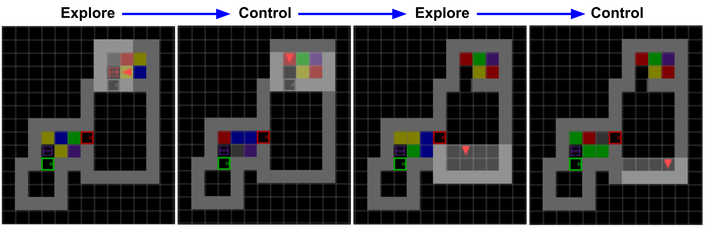

# Explore and Control with Adversarial Surprise

Paper: https://arxiv.org/abs/2107.07394 \
Project Page: https://sites.google.com/corp/view/adversarial-surprise/home 

In this repo we provide:
- Our suite of procedurally-generated MiniGrid environments containing controllable noisy rooms and dark rooms to test the exploration and control ability of RL agents in stochastic partially-observable environments.
- Our implementation of Adversarial Surprise that efficiently explore and control these environments.

The illustration below shows an example of procedurally-generated environment and the Adversarial Surprise agent exploring it. Each environment contains:
- Controllable noisy rooms with flashing lights on the floor. The color of each floor tile is randomly and independently selected among a set of 6 colors. This produces stochastic perturbations that can trap agents seeking novelty only. Importantly, each noisy room contains a box that can freeze the lights when opened by the agent. 
- Dark rooms, where the agent can always keep the same observation by staying still.



To run the training and testing of an Adversarial Surprise agent on our MiniGrid procgen environements, simply execute:
```
sh run.sh
```
  
